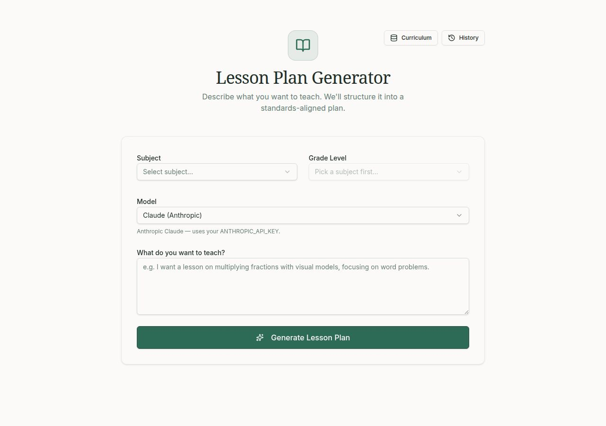
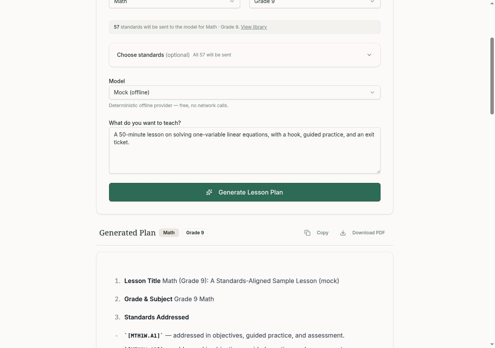
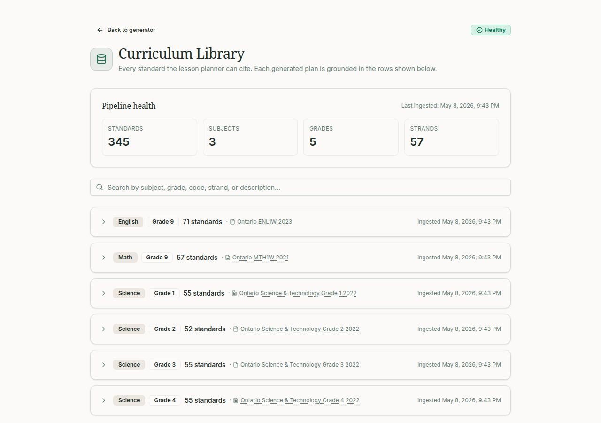
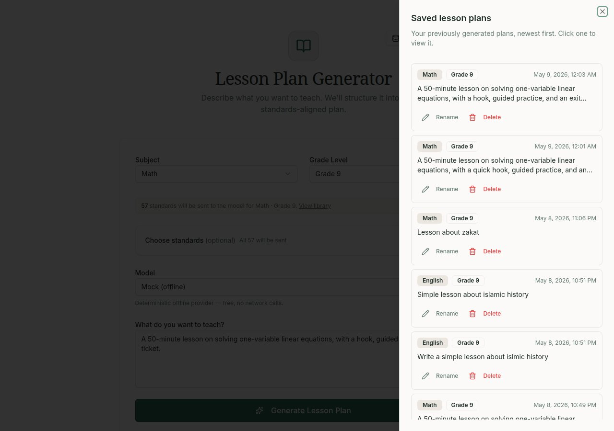

# Lesson Plan Generator

> A standards-grounded lesson plan generator. Teachers describe what they want
> to teach; the app returns a full plan with every step traceable to a real
> Ontario curriculum standard.



---

## What it does

- **Free-text in, structured plan out** — type a request like *"a 50-minute
  lesson on solving linear equations for Grade 9"* and get back a nine-section
  lesson plan: objectives, materials, a timed outline, assessment, and
  differentiation.
- **Real curriculum citations, verified** — every objective and activity step
  ends with a `[CODE]` marker that points to an actual Ontario standard. A
  post-call validator flags any code the model invented.
- **Swappable model** — Claude (Anthropic), GPT (OpenAI via Replit AI
  Integrations), or a deterministic offline Mock provider for running with no
  API key.
- **Curriculum library + history** — browse every standard the app can cite,
  download the source PDFs, and revisit any plan you've generated.

## Screenshots


*A generated plan, grouped by section, with citation chips that jump to where each standard is used.*


*The curriculum library — every standard the lesson planner can cite, grouped by subject and grade.*


*The History sheet — every plan you've generated, restorable in one click.*

---

## How the "RAG-lite" grounding works

Most retrieval-augmented projects reach for embeddings and a vector store. This
one doesn't — and doesn't need to. The curriculum lives in a small SQLite table
keyed by `(subject, grade)`, so retrieval is a plain `SELECT … WHERE subject =
? AND grade = ?`. The matching standards are formatted as a `[CODE] strand:
description` block and pasted directly into the user prompt, and the system
prompt forbids Claude from citing any code that isn't in that block. After the
model responds, a regex extracts every `[CODE]` marker and cross-checks it
against the rows we actually sent — invented codes are surfaced in the UI as
"unverified" rather than silently shipped. It's RAG without the vector
overhead, and it works because the retrieval key is fully structured.

For a deeper walkthrough — including when embeddings would actually start to
pay off — see [`docs/rag-lite.md`](docs/rag-lite.md).

## Tech stack

- **Backend** — FastAPI + SQLite, with a tiny `LLMProvider` interface so
  models are swappable in one file.
- **Frontend** — React + Vite + shadcn/ui + TanStack Query, served by Vite's
  dev server with a `/lesson-api/*` proxy to the backend.
- **LLMs** — Anthropic Claude and OpenAI GPT via Replit AI Integrations
  (no API keys to manage in dev), plus an offline Mock provider for tests
  and demos.
- **Monorepo** — pnpm workspace with each runnable thing under `artifacts/`.

## Run it locally

```bash
# 1. Install JS dependencies
pnpm install

# 2. Install Python dependencies for the backend
cd artifacts/lesson-plan-api && pip install -r requirements.txt && cd ../..

# 3. Set your Anthropic key (skip this and use the mock provider if you don't have one)
export ANTHROPIC_API_KEY=sk-ant-...

# 4. Start the two services in two terminals:
#    - FastAPI backend on :8000
cd artifacts/lesson-plan-api && uvicorn main:app --host 0.0.0.0 --port 8000 --reload

#    - Vite frontend (proxies /lesson-api/* to :8000)
PORT=5173 BASE_PATH=/ pnpm --filter @workspace/lesson-planner run dev
```

The frontend's `vite.config.ts` reads `PORT` and `BASE_PATH` from the
environment so the same artifact can be served behind any path prefix. On
Replit, the workflows set these automatically; outside Replit, pass them
inline as shown above (or put them in a `.env`).

**No API key?** Pick **Mock (offline)** in the model dropdown — it returns a
deterministic, fully-formed nine-section plan with real `[CODE]` citations
drawn from the curriculum DB, with zero network calls.

## Project structure

```
.
├── artifacts/
│   ├── lesson-plan-api/   # FastAPI backend — prompt assembly, retrieval, LLM provider, SQLite
│   └── lesson-planner/    # React + Vite frontend — generate form, plan view, curriculum library
├── docs/
│   ├── architecture.md    # Full request flow, prompt construction, ingestion, providers
│   ├── rag-lite.md        # Why this project doesn't use embeddings (and when it should)
│   └── screenshots/       # Images used in this README
└── pnpm-workspace.yaml
```

For the annotated full tree and a line-by-line walkthrough of how a request
flows from the React form through the prompt builder to Claude and back, see
[`docs/architecture.md`](docs/architecture.md).

## Further reading

- [`docs/architecture.md`](docs/architecture.md) — full annotated tree, request
  flow, prompt construction, citation validation, curriculum ingestion, and
  how to swap the LLM.
- [`docs/rag-lite.md`](docs/rag-lite.md) — why curriculum grounding here is a
  SQL lookup, not a vector search, and the conditions under which embeddings
  would start to earn their keep.
- [`artifacts/lesson-plan-api/README.md`](artifacts/lesson-plan-api/README.md)
  — backend-only setup, endpoint reference, and provider plug-in instructions.
